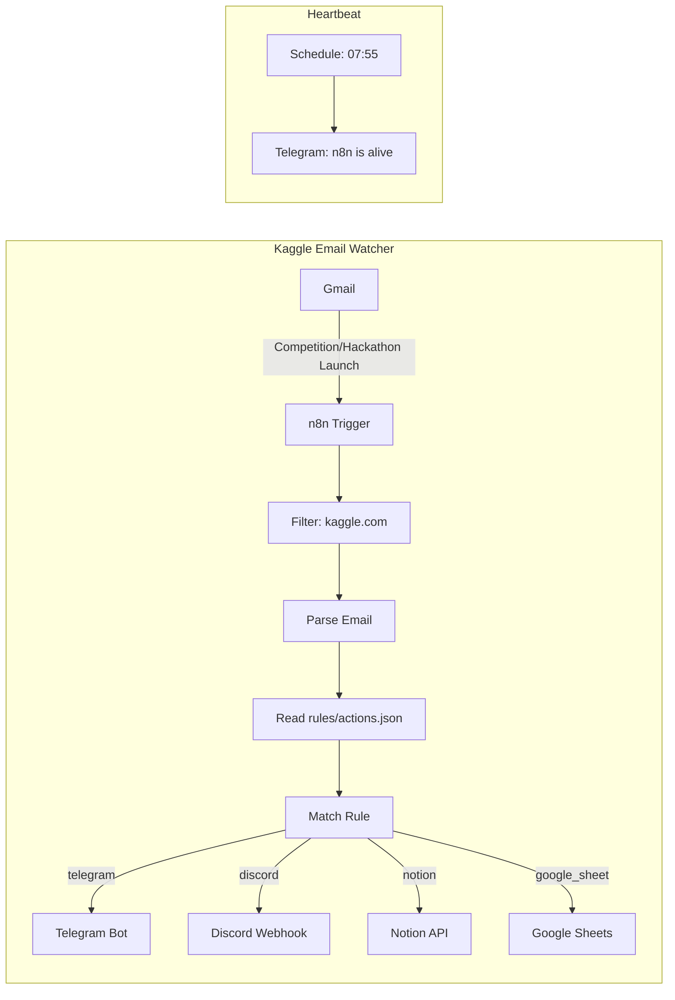

# n8n-kaggle-watcher

[](https://github.com/benoit-bremaud/n8n-kaggle-watcher/actions/workflows/validate.yml)
[](LICENSE)
[](https://n8n.io)
[](docker/docker-compose.yml)

Automated Kaggle competition email watcher. Detects "Competition Launch" emails from Kaggle, parses competition details, and routes notifications via configurable rules.

## Architecture



## Prerequisites

- [Docker](https://docs.docker.com/get-docker/) and Docker Compose
- Gmail account with API access ([setup guide](docs/setup-gmail-oauth.md))
- Telegram Bot token ([setup guide](docs/setup-n8n.md#telegram))

## Quick Start

```bash
# 1. Clone
git clone https://github.com/benoit-bremaud/n8n-kaggle-watcher.git
cd n8n-kaggle-watcher

# 2. Configure environment
cp docker/.env.example docker/.env
# Edit docker/.env with your credentials

# 3. Start n8n
make up

# 4. Open n8n UI
open http://localhost:5678

# 5. Import workflow
# File → Import from file → select workflows/kaggle-email-watcher.json

# 6. Configure credentials in n8n
# See docs/setup-gmail-oauth.md and docs/setup-n8n.md
```

## Rules Configuration

Edit `rules/actions.json` to define how competitions are routed:

```json
{
  "rules": [
    {
      "id": "rule-ml-ia",
      "name": "AI/ML Competitions",
      "match": {
        "track": ["AI/ML", "Machine Learning", "Deep Learning"]
      },
      "actions": [
        {
          "type": "telegram",
          "config": {
            "chat_id": "",
            "message_template": "New {track} competition: {competition_name}"
          }
        }
      ]
    }
  ]
}
```

Rules are evaluated top-to-bottom. First match wins. Use `"track": ["*"]` as a catch-all.

### Supported Action Types

| Type           | Description                  | Status      |
| -------------- | ---------------------------- | ----------- |
| `telegram`     | Send Telegram message        | Implemented |
| `discord`      | Post to Discord webhook      | Planned     |
| `notion`       | Create Notion database entry | Planned     |
| `google_sheet` | Append row to Google Sheet   | Planned     |
| `webhook`      | Generic HTTP webhook         | Planned     |
| `log_only`     | Log to n8n console           | Planned     |

### Template Variables

Available in `message_template`:

| Variable             | Description                  |
| -------------------- | ---------------------------- |
| `{competition_name}` | Competition/hackathon name   |
| `{event_type}`       | `competition` or `hackathon` |
| `{deadline}`         | Entry deadline date          |
| `{prize}`            | Total prize amount           |
| `{track}`            | Track/category (if available)|
| `{url}`              | Kaggle competition URL       |

## Development

```bash
make help       # Show available commands
make validate   # Validate JSON files
make up         # Start n8n
make down       # Stop n8n
make logs       # Follow n8n logs
```

## CI

GitHub Actions validates JSON files on every PR to `main`:

- `rules/actions.json` is validated against `rules/actions.schema.json`
- `workflows/kaggle-email-watcher.json` syntax is checked

## License

MIT
