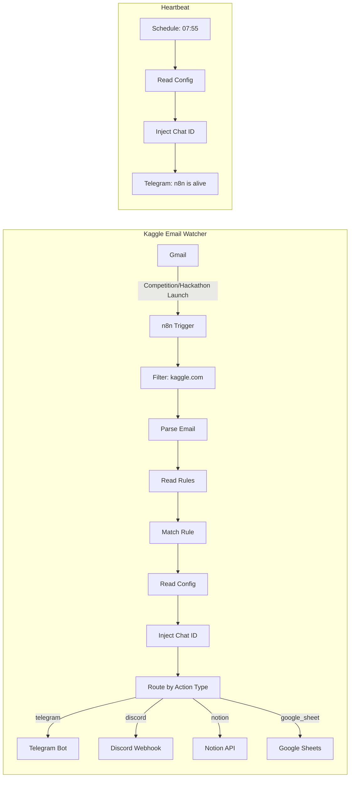

# n8n-kaggle-watcher

[](https://github.com/benoit-bremaud/n8n-kaggle-watcher/actions/workflows/validate.yml)
[](LICENSE)
[](https://n8n.io)
[](docker/docker-compose.yml)

Automated Kaggle competition and hackathon email watcher. Detects "Competition Launch" and "Hackathon Launch" emails from Kaggle, parses event details, and routes notifications via configurable rules.

## Architecture



## Prerequisites

- [Docker](https://docs.docker.com/get-docker/) and Docker Compose
- Gmail account with API access ([setup guide](docs/setup-gmail-oauth.md))
- Telegram Bot token ([setup guide](docs/setup-n8n.md#2-create-telegram-bot-and-get-chat-id))

## Quick Start

```bash
# 1. Clone
git clone https://github.com/benoit-bremaud/n8n-kaggle-watcher.git
cd n8n-kaggle-watcher

# 2. Configure environment
cp docker/.env.example docker/.env
cp rules/telegram-config.json.example rules/telegram-config.json
# Edit both files with your credentials and chat ID

# 3. Start n8n
make up

# 4. Open n8n UI and import workflows
# See docs/setup-n8n.md for step-by-step instructions
```

For the complete setup guide including Gmail OAuth, Telegram bot creation, workflow import, and credential configuration, see [docs/setup-n8n.md](docs/setup-n8n.md).

## Rules Configuration

Edit `rules/actions.json` to define how competitions are routed:

```json
{
  "rules": [
    {
      "id": "rule-ml-ia",
      "name": "AI/ML Competitions",
      "match": {
        "track": ["AI/ML", "Machine Learning", "Deep Learning"]
      },
      "actions": [
        {
          "type": "telegram",
          "config": {
            "chat_id": "YOUR_CHAT_ID",
            "message_template": "New {track} competition: {competition_name}"
          }
        }
      ]
    }
  ]
}
```

Rules are evaluated top-to-bottom. First match wins. Use `"track": ["*"]` as a catch-all.

### Supported Action Types

| Type           | Description                  | Status      |
| -------------- | ---------------------------- | ----------- |
| `telegram`     | Send Telegram message        | Implemented |
| `discord`      | Post to Discord webhook      | Planned     |
| `notion`       | Create Notion database entry | Planned     |
| `google_sheet` | Append row to Google Sheet   | Planned     |
| `webhook`      | Generic HTTP webhook         | Planned     |
| `log_only`     | Log to n8n console           | Planned     |

### Template Variables

Available in `message_template`:

| Variable             | Description                  |
| -------------------- | ---------------------------- |
| `{competition_name}` | Competition/hackathon name   |
| `{event_type}`       | `competition` or `hackathon` |
| `{deadline}`         | Entry deadline date          |
| `{prize}`            | Total prize amount           |
| `{track}`            | Track/category               |
| `{url}`              | Kaggle competition URL       |

## Development

```bash
make help       # Show available commands
make validate   # Validate JSON files
make lint       # Run linters (YAML, shell, markdown)
make check      # Run all checks (validate + lint)
make up         # Start n8n
make down       # Stop n8n
make logs       # Follow n8n logs
```

## CI

GitHub Actions runs 3 jobs on every PR to `main`:

- **JSON Validation** — `rules/actions.json` validated against schema, all `workflows/*.json` syntax-checked
- **Lint** — yamllint, shellcheck, markdownlint
- **Secret Detection** — gitleaks scans PR diff for leaked credentials

## License

MIT
